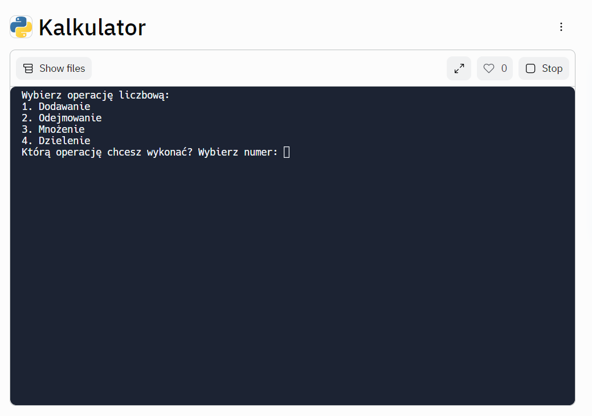

# Kalkulator
> Simple calculator created with replit.com.
> Live demo [_here_](https://replit.com/@BartlomiejLis/Kalkulator?v=1). <!-- If you have the project hosted somewhere, include the link here. -->

## Table of Contents
* [General Info](#general-information)
* [Technologies Used](#technologies-used)
* [Screenshots](#screenshots)
* [Usage](#usage)
* [Project Status](#project-status)
* [Room for Improvement](#room-for-improvement)
* [Acknowledgements](#acknowledgements)
* [Contact](#contact)
<!-- * [License](#license) -->

## General Information
My motivation to create Kalkulator app was to learn Python language.
To create it I used one of the free programming courses of Kodilla programming school.

## Technologies Used
- Python - version 1.0

## Screenshots

<!-- If you have screenshots you'd like to share, include them here. -->

## Usage
The program works in text form. Follow instructions on your screen to start using it.

## Project Status
Project is: _no longer being worked on_.

## Room for Improvement
- Fixing problem with division by zero.

## Acknowledgements
This project was based on [this tutorial](https://kodilla.com/pl/python-wyzwanie-form).
The multiplication and division function has been added.

## Contact
Created by Bartłomiej Lis - feel free to contact me!

<!-- Optional -->
<!-- ## License -->
<!-- This project is open source and available under the [... License](). -->

<!-- You don't have to include all sections - just the one's relevant to your project -->
